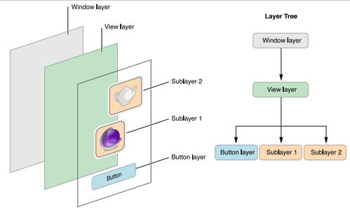
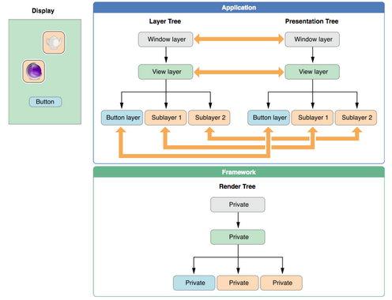

CoreAnimationTest 练习例子
================
目录
---
1、[图层和视图的区别](#anchor1)

2、[绘图/重绘](#anchor2)

3、[离屏渲染](#anchor3)

* * *
##[图层和视图的区别](id:anchor1)

* `图层与视图的对应关系`
> 每一个图层对象集合被组织在一个层次结构中(图层树)，类似于app中的视图。一个视图可以添加另外的图层对象，因此图层与视图是不相关联的。可以按照需求将图层对象插入到指定的视图层级中。你可能为了优化app内容的性能而选择加入图层对象而非视图，原因在于图层的开销要比视图低。图1-9展示了出现在一个简单iOS app的图层分解图。在示例中窗口包含了一个内容视图，内容视图包含了一个按钮视图和两个独立的图层对象。每一个视图拥有一个相对应的构成图层层次的图层对象。
> 
> 另外：在图层树中的每一个对象，在渲染树和呈现树中也存在一个与之匹配的对象。如图1-10所示。正如之前提到过的，app主要与图层树中的对象进行交互，但可能有时会访问呈现树中的对象。具体地，访问图层树中对象的presentationLayer属性将返回一个在呈现树中相对应的对象。你可能会通过该对象获取在动画执行过程中的某一时刻的属性值。
> 
 
* `图层不是视图的替代品`
 > 图层不是视图的替代品。因此无法创建一个基于单一图层对象的可视界面。图层是视图的基础设施。具体地，图层让视图的绘图和动画更简单和高效，并且能在绘图和动画时保持高帧率。然而许多事情图层无法做到。图层不能处理事件、绘制内容，特别是在响应链中，或是做一些其他的事情。因此，每个app必须有一个或多个视图来处理这类交互。
 
 * `基于图层的绘图和基于视图的绘图在技术上有明显的不同。 `
 > 1. 对基于视图的绘图对视图的改变经常会触发调用视图的drawRect：方法以重绘视图内容。但是此种方式的代价相对较高，因为它是CPU在主线程上的操作 
    2. 基于图层的绘制模型大部分图层不做实际的绘图操作。相反，图层捕获应用的内容并缓存它们到位图中。当你随后改变了一个图层的属性值，你做的所有工作只是改变了与图层对象相关联的状态信息。 
 
 * * *
 
##[绘图/重绘](id:anchor2)
再drawRect里面绘图，调用Core Graphics来绘图，代价很昂贵。尽量避免在软件中绘图
 
 ```
 “术语绘图通常在Core Animation的上下文中指代软件绘图（意即：不由GPU协助的绘图）。在iOS中，软件绘图通常是由Core Graphics框架完成来完成。但是，在一些必要的情况下，相比Core Animation和OpenGL，Core Graphics要慢了不少。

    软件绘图不仅效率低，还会消耗可观的内存。CALayer只需要一些与自己相关的内存：只有它的寄宿图会消耗一定的内存空间。即使直接赋给contents属性一张图片，也不需要增加额外的照片存储大小。如果相同的一张图片被多个图层作为contents属性，那么他们将会共用同一块内存，而不是复制内存块。

    但是一旦你实现了CALayerDelegate协议中的-drawLayer:inContext:方法或者UIView中的-drawRect:方法（其实就是前者的包装方法），图层就创建了一个绘制上下文，这个上下文需要的大小[…]”

摘录来自: 钟声. “ios核心动画高级技巧”。 iBooks. 
 ```
 
## [离屏渲染](id:anchor3)
 设置圆角、阴影等会导致离屏渲染。
 
## +imageNamed: 与 +imageWithContentsOfFile: 的区别

```
1、+imageNamed加载的图片会缓存起来，适合用与要多次使用的图片。+imageWithContentsOfFile: 每次都会生成一块内存用来存储图片。
2、图片都是有压缩的，png图片文件大但是解码快，jpeg文件小但是解码慢。iOS通常会延迟解压图片的时间，一般是等到加载到内存之后。这就会在准备绘制图片的时候影响性能，因为需要在绘制之前进行解压。 +imageNamed：方法避免延时解压。+imageWithContentsOfFile:会有延时解压
3、+imageNamed:只对从应用资源束中的图片有效
```

## 